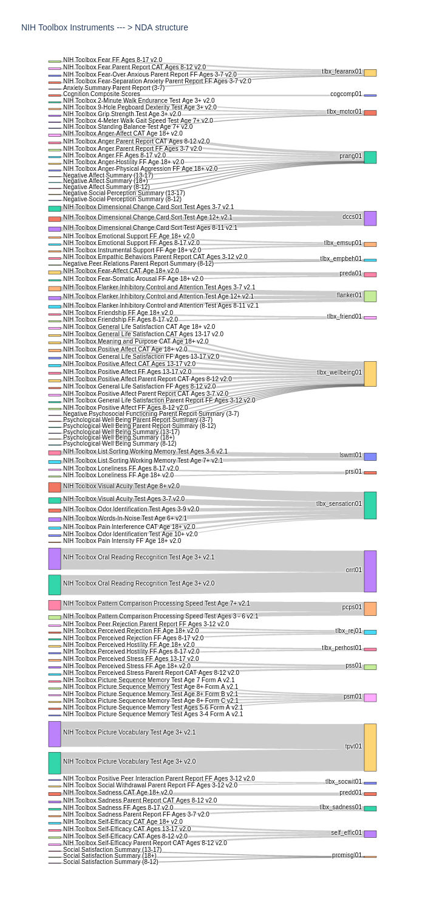
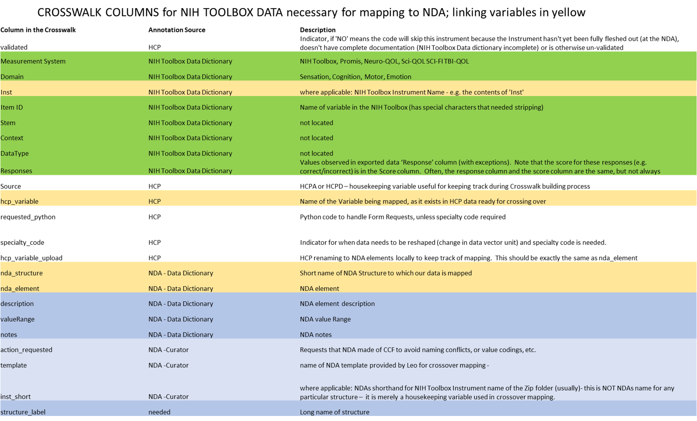
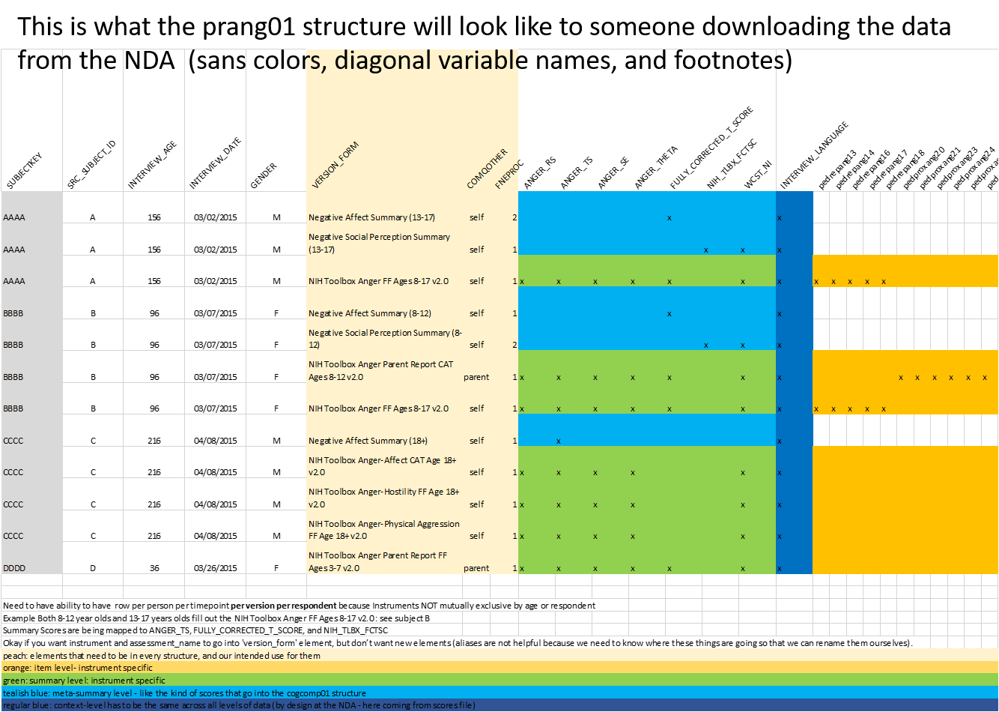

# NIHToolbox2NDA
Main notebook: IPADexports_2_NDAstructures.ipynb - necessary functions for the transformation of your IPAD data to NDA format, using the version controlled crosswalk file (Crosswalk_NIH_Toolbox_2_NDA.csv)

Other flavors of this main notebook:
IPADexports_2_NDAstructures_Windows.ipynb #has helpful comments for Windows Users
IPADexports_2_NDAstructures_HCPspecificss.ipynb  #main notebook plus HCP specific record selections and QCsteps not be generalizable to other studies but published for complete transparency

Most important thing to version control: Crosswalk_NIH_Toolbox_2_NDA.csv - this file provides the unavoidably hardcoded variable map between IPAD and NDA data universes

General Overview:

THE NIH Toolbox Data coming out of the IPAD app looks very different than the format required by the NDA (see 'Intro to NIH Toolbox Data as it pertains to harmonization with the NDA.pptx' in this repo for deeper description), in large part because the NIH Toolbox changed their output format to better handle scalability and versioning across instruments, and the NDA structures were already built.  In order to reformat the IPAD data en masse without losing version information in a merge process (see sankey diagram), we do two main things before embarking on the tedious 1 to 1 mapping of variables via a Crosswalk between data dictionaries.

1.  We pivot all of the item level scores coming from the 'raw data' file of the IPAD output, such that all item level answers for a given instrument/PIN are put onto a single row which can then be merged with the scored data (already one row per instrument/PIN).  WARNING: this essentially ignores/discards all item level context saved in your NIH TOOLBOX IPad output.  PLEASE SAVE PRE-TRANSFORMED TOOLBOX DATA FOR REFERENCE. The NDA does not have structural capacity to handle pivots of item level context in addition to item level scores at this time. Most assuredly, you will need some or all of this information in the future.

2. With one exception [cogcomp01 - see discussion inline] we contextualize this information by adding the string stored in the NIH Toolbox 'Inst' column (Instrument) into 'version_form,' the string in 'Assessment Name' into 'fneproc', and a created string 'respondent' (parent/child) into 'comqother,' such that multiple (versioned) instruments going to the same structure can be stored as repeated measurements in a queriable way, given the variable to element mappings known through the crosswalk (or because you're savvy with aliases in the NDA's data dictionary API).  Again, check out the .pptx in this repo, if this isn't clear, for a more in-depth explanation and a chance to question the logic of the decisions encoded here.  

With one exception [see cogcomp01 discussion inline], the resulting structures are thus organized as 1 row per subject per visit_date per NIH Toolbox Instrument, per Assessment, per respondent.  

SPECIAL NOTE:  Some NDA aliases are universal; others are study-specific.  Alias origins or universality in the NDA data dictionary are not immediately clear or easily extracted (see documentation for the NDA data dictionary API).  We chose to map our data directly to the NDA element that would contain the data so as to maintain complete and externally documented transparency over this mapping process.

Order of operations:

0.   If this is your very first behavioral data submission to the NDA, begin with their documentation for a general overview (https://nda.nih.gov/contribute/contribute-data.html), then review the slides from the power point in this repository (Intro to NIH Toolbox Data as it pertains to harmonization with the NDA.pptx), which describe NIH Toolbox IPAD export data harmonization specifically.  Then open the Crosswalk and review the column definitions in the image below, so you have a general sense of the information it contains and what the subsequent steps will be attempting to accomplish. Note that some of the necessary parts may not make sense until you get ALL THE WAY TO THE END and see what the data will look like when downloaded FROM the NDA (see prang01 example) image at the end of this README

1.  Concatenate all the scores files you received from the IPADS.  Concatenate all the raw data (item level) files you received from the IPADs. Check that the unique PINS in the concantenated scores file matches the list of unique pins in the concatenated raw data files.  The logic of this entire transformation depends on having a one to one matching of PINs in these files.  

2. prepare the NDA fields info file for your data - e.g. a csv with subjectkey (GUID or pseudo-GUID), src_subject_id (e.g. PIN, or subject or whatever you call it -ex. HCP0211999), interview_age (in months), and gender (misnomer for sex assigned at birth - misnomer has been fixed and you can now upload your data as sex, but I'm pretty sure it's just an alias for gender, so you might as well upload as gender to maintain consistency.

3. Run the IPADexports_2_NDAstructures.ipynb jupyter notebook to transform your concatenated IPAD exports into NDA-formatted uploadable csv files based on the Crosswalk that has been curated in this repository.  If the crosswalk doesn't have the instrument you used, you can flesh out necessary rows to append to the existing crosswalk using other tools from this repo (e.g. crosswalkscratch.py, or the grab annotation notebooks using instructions within them)
      
4. Start asking questions by opening an 'issue' in the repo, until I figure out a better way of making this tool more user friendly. Contribute new rows/instruments to what will hopefully be a universal crosswalk for IPAD users, by opening a pull request.  THANK YOU!!!

